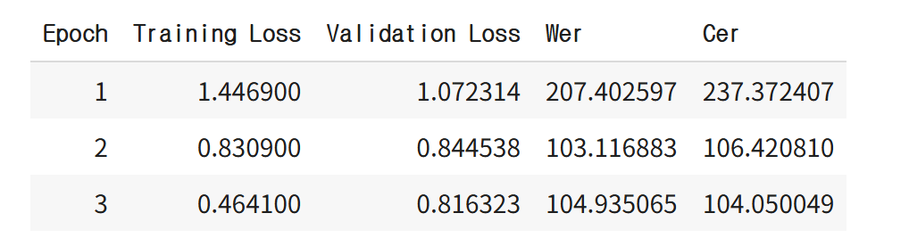
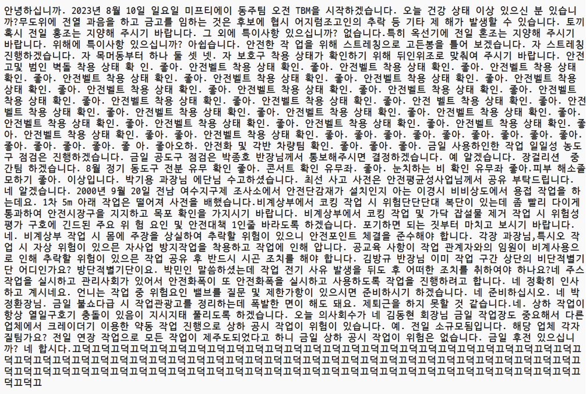
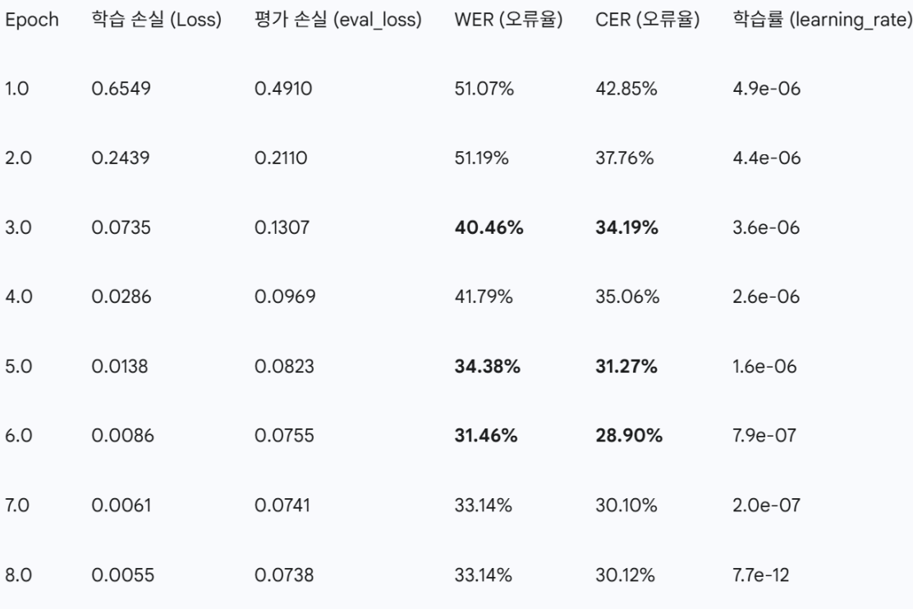
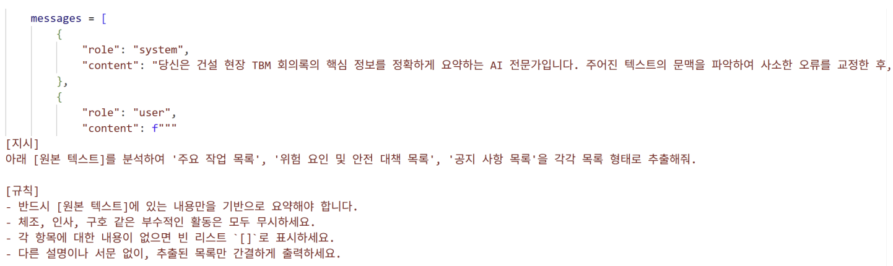

# 🚀 TBM 회의록 자동 분석 모듈: 개발 일지

본 문서는 `위솔루션 안전관리시스템 고도화 프로젝트`의 상세한 개발 과정을 기록합니다.

---

## 🗓️ 1, 2주차 (7/2 ~ 7/11): STT 모델 개발 및 LLM 연동 기반 기술 검증

1주차에는 프로젝트의 기술적 타당성을 검증하고 핵심 AI 모델을 구축하는 데 집중했습니다.

### Part 1. TBM 특화 음성인식(STT) 모델 개발

- **초기 난관: 과적합(Overfitting) 문제 직면**
  - `Whisper-small` 모델을 소량의 TBM 데이터로 직접 파인튜닝 시, 모델이 훈련 데이터만 암기하여 처음 듣는 음성에는 의미 없는 단어를 반복하는 '고장 현상' 발생.
  - 
  - 

- **해결 계획: 3단계 점진적 파인튜닝 전략 수립 및 실행**
  - **1단계 (일반화):** AI-Hub의 '일반 회의 데이터'(15시간)로 사전 훈련하여, 모델의 일반적인 대화 이해 능력 확보 (CER 50.4% 달성).
  - **2단계 (전문화):** 1단계 모델을 '실제 TBM 데이터'(1시간)로 훈련시켜, TBM 전문 용어 학습.
  - **3단계 (강인화):** 데이터 증강(Data Augmentation) 기법을 적용한 데이터로 훈련시켜, 현장 소음 및 다양한 발화 환경에 대한 대응 능력 강화.

- **해결 성과: WER, CER 점수 대폭 하향**
  - 검증 데이터셋 기준 **CER(글자 오류율) 28.9%** 달성.
  - 

### Part 2. LLM 기반 정보 추출 테스트

- **초기 난관: 'Garbage In, Garbage Out' 문제**
  - STT 결과물에 남은 작은 오류들로 인해, 소형 언어 모델(LLM)이 문맥을 이해하지 못하고 관련 없는 내용을 지어내는 **환각(Hallucination)** 현상 발생.
- **해결 계획: 고도화된 프롬프트 엔지니어링 적용**
  - 모델의 역할을 명확히 정의하고, '작업-위험-대책'의 관계를 학습시키며, 구체적인 출력 형식을 제공하는 등 프롬프트를 점진적으로 개선.
  - 
---

## 🗓️ 3주차 (7/14 ~ 7/18): STT 모델 파인튜닝 및 계획 수정

3주차에는 STT 모델의 성능을 더욱 끌어올리기 위한 추가 파인튜닝과 함께, 데이터셋 전략에 대한 계획 수정.

### Part 1. STT 모델 추가 파인튜닝 및 데이터셋 전략 재수립

* **초기 난관: 물류 오디오 데이터의 도메인 불일치**
    * 6시간 분량의 물류 회사 오디오 데이터셋을 추가 확보하여 파인튜닝했으나, 건설 도메인과의 괴리로 인해 오히려 모델 성능이 저하되는 문제 발생.
* **결론: 데이터셋 전략 수정**
    * 물류 데이터셋은 과감하게 폐기하고, **건설 도메인 데이터에만 집중**하는 것으로 전략을 재수립했습니다.

#### PEFT (LoRA) 기반 파인튜닝 (1차)

AI-Hub 데이터로 사전 훈련된 모델에 1시간 분량의 건설 TBM 데이터셋을 PEFT(LoRA) 기법으로 학습시켰습니다.

<strong>클릭하여 1차 하이퍼파라미터 확인</strong>

* **학습 파라미터**
    * `learning_rate`: 5e-6
    * `per_device_train_batch_size`: 12
    * `gradient_accumulation_steps`: 2
    * `num_train_epochs`: 10
    * `lr_scheduler_type`: "cosine"
    * `warmup_steps`: 15
* **PEFT (LoRA) 파라미터**
    * `r`: 32
    * `lora_alpha`: 64
    * `target_modules`: ["q_proj", "v_proj"]
    * `lora_dropout`: 0.2

* **성과:** 11번의 하이퍼파라미터 수정을 거쳐 **CER 43%**를 달성했습니다.
* **[images/peft1.png]**

#### 데이터 증강 및 PEFT (LoRA) 기반 파인튜닝 (2차)

성능 향상을 위해 추가 데이터를 생성하고 2차 파인튜닝을 진행했습니다.

* **데이터 추가 확보:** `train` 데이터셋에서 오류율(CER)이 가장 높은 30개 문장을 추출하고, TTS(Clova Dubbing) 및 TBM 예시를 활용하여 30분 분량의 데이터셋 추가 확보.
* **하이퍼파라미터 변경:** `lora_dropout`을 0.3으로 높이고, `r`과 `lora_alpha`를 각각 16, 32로 조정하여 모델의 복잡도를 낮췄습니다.

* **성과:** 추가 파인튜닝 결과 **CER 32%**를 달성하며 모델 성능을 의미 있게 개선했습니다.
* **[images/peft2]**

### Part 2. 한국어 특화 STT 모델 서칭

`Whisper-small` 모델의 한국어 인식 성능에 아쉬움을 느껴, 더 나은 대안을 찾기 위해 한국어에 특화된 STT 모델 서칭을 시작했습니다. 이는 향후 모델 성능을 한 단계 더 끌어올리기 위한 중요한 발판이 될 것입니다.