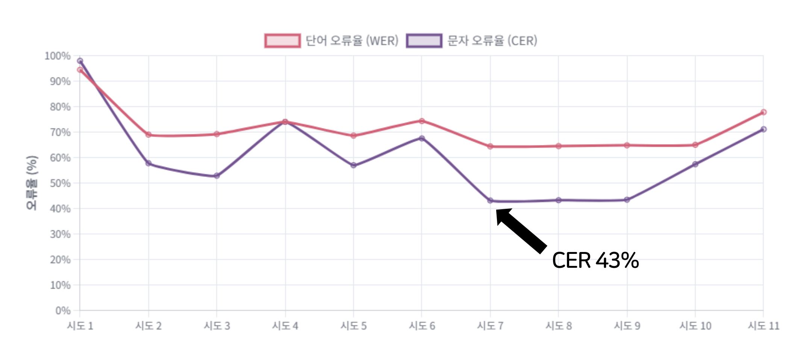
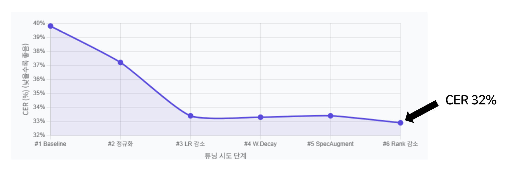
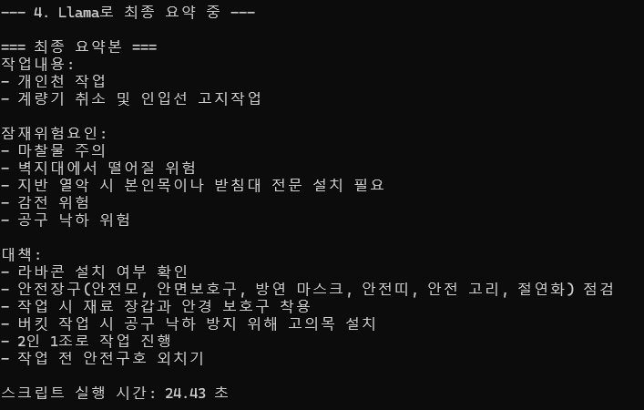

# 🚀 TBM 회의록 자동 분석 모듈: 개발 일지

본 문서는 `위솔루션 안전관리시스템 고도화 프로젝트`의 상세한 개발 과정을 기록합니다.

---

## 🗓️ 1, 2주차 (7/2 ~ 7/11): STT 모델 개발 및 LLM 연동 기반 기술 검증

1주차에는 프로젝트의 기술적 타당성을 검증하고 핵심 AI 모델을 구축하는 데 집중했습니다.

### Part 1. TBM 특화 음성인식(STT) 모델 개발

- **초기 난관: 과적합(Overfitting) 문제 직면**
  - `Whisper-small` 모델을 소량의 TBM 데이터로 직접 파인튜닝 시, 모델이 훈련 데이터만 암기하여 처음 듣는 음성에는 의미 없는 단어를 반복하는 '고장 현상' 발생.
  - 
  - 

- **해결 계획: 3단계 점진적 파인튜닝 전략 수립 및 실행**
  - **1단계 (일반화):** AI-Hub의 '일반 회의 데이터'(15시간)로 사전 훈련하여, 모델의 일반적인 대화 이해 능력 확보 (CER 50.4% 달성).
  - **2단계 (전문화):** 1단계 모델을 '실제 TBM 데이터'(1시간)로 훈련시켜, TBM 전문 용어 학습.
  - **3단계 (강인화):** 데이터 증강(Data Augmentation) 기법을 적용한 데이터로 훈련시켜, 현장 소음 및 다양한 발화 환경에 대한 대응 능력 강화.

- **해결 성과: WER, CER 점수 대폭 하향**
  - 검증 데이터셋 기준 **CER(글자 오류율) 28.9%** 달성.
  - 

### Part 2. LLM 기반 정보 추출 테스트

- **초기 난관: 'Garbage In, Garbage Out' 문제**
  - STT 결과물에 남은 작은 오류들로 인해, 소형 언어 모델(LLM)이 문맥을 이해하지 못하고 관련 없는 내용을 지어내는 **환각(Hallucination)** 현상 발생.
- **해결 계획: 고도화된 프롬프트 엔지니어링 적용**
  - 모델의 역할을 명확히 정의하고, '작업-위험-대책'의 관계를 학습시키며, 구체적인 출력 형식을 제공하는 등 프롬프트를 점진적으로 개선.
  - 
---

## 🗓️ 3주차 (7/14 ~ 7/18): STT 모델 파인튜닝 및 계획 수정

3주차에는 STT 모델의 성능을 더욱 끌어올리기 위한 추가 파인튜닝과 함께, 데이터셋 전략에 대한 계획 수정.

### Part 1. STT 모델 추가 파인튜닝 및 데이터셋 전략 재수립

* **초기 난관: 물류 오디오 데이터의 도메인 불일치**
    * 6시간 분량의 물류 회사 오디오 데이터셋을 추가 확보하여 파인튜닝했으나, 건설 도메인과의 괴리로 인해 오히려 모델 성능이 저하되는 문제 발생.
* **결론: 데이터셋 전략 수정**
    * 물류 데이터셋은 과감하게 폐기하고, **건설 도메인 데이터에만 집중**하는 것으로 전략을 재수립했습니다.

#### PEFT (LoRA) 기반 파인튜닝 (1차)

AI-Hub 데이터로 사전 훈련된 모델에 1시간 분량의 건설 TBM 데이터셋을 PEFT(LoRA) 기법으로 학습시켰습니다.

<strong>클릭하여 1차 하이퍼파라미터 확인</strong>

* **학습 파라미터**
    * `learning_rate`: 5e-6
    * `per_device_train_batch_size`: 12
    * `gradient_accumulation_steps`: 2
    * `num_train_epochs`: 10  
    * `lr_scheduler_type`: "cosine"
    * `warmup_steps`: 15
* **PEFT (LoRA) 파라미터**
    * `r`: 32
    * `lora_alpha`: 64
    * `target_modules`: ["q_proj", "v_proj"]
    * `lora_dropout`: 0.2

* **성과:** 11번의 하이퍼파라미터 수정을 거쳐 **CER 43%**를 달성했습니다.
* - 

#### 데이터 증강 및 PEFT (LoRA) 기반 파인튜닝 (2차)

성능 향상을 위해 추가 데이터를 생성하고 2차 파인튜닝을 진행했습니다.

* **데이터 추가 확보:** `train` 데이터셋에서 오류율(CER)이 가장 높은 30개 문장을 추출하고, TTS(Clova Dubbing) 및 TBM 예시를 활용하여 30분 분량의 데이터셋 추가 확보.
* **하이퍼파라미터 변경:** `lora_dropout`을 0.3으로 높이고, `r`과 `lora_alpha`를 각각 16, 32로 조정하여 모델의 복잡도를 낮췄습니다.

* **성과:** 추가 파인튜닝 결과 **CER 32%**를 달성하며 모델 성능을 의미 있게 개선했습니다.
* - 

### Part 2. 한국어 특화 STT 모델 서칭 시작

`Whisper` 모델의 근본적인 한계를 느끼고, 더 나은 성능을 위해 한국어 데이터로 사전 학습된 모델을 탐색하기 시작했습니다.

---

## 🗓️ 4-5주차 (7/18 ~ 8/1): 모델 최종 최적화 및 시스템 통합

프로젝트 후반부에는 최종 성능 목표를 달성하기 위한 모델 최적화와 전체 시스템을 완성하는 데 집중했습니다.

### Part 1. 한국어 특화 STT 모델 선정 및 최종 성능 달성

* **베이스 모델 선정:** 3주차에 시작한 리서치를 통해 Hugging Face의 다양한 한국어 특화 Whisper 모델들을 평가했습니다. 그중 TBM 데이터셋에서 가장 낮은 CER(32%)을 보인 **`seastar105/whisper-small-komixv2`** 모델을 최종 베이스 모델로 선정했습니다.
* **하이퍼파라미터 최적화:** 약 30회의 반복적인 실험을 통해 학습률, 배치 크기 등 최적의 하이퍼파라미터를 찾아냈습니다. ([PEFT.py](src/PEFT.py))
* **최종 성과: CER 17% 달성**
    * 지속적인 튜닝을 통해 최종적으로 **목표치를 뛰어넘는 CER 17%**라는 우수한 성능을 확보했습니다.

### Part 2. 모델 경량화 및 LLM 요약 모듈 구축

* **STT 모델 양자화:** 배포 효율성을 위해 4비트 양자화(4-bit Quantization)를 적용, 기존 **462MB**였던 모델 크기를 **182MB**로 획기적으로 줄였습니다.
* **요약 LLM 선정:** 한국어 성능이 뛰어난 SKT의 **`A.X 4.0 Light`** 모델(3비트 양자화 버전)을 정보 추출 및 요약 모듈로 채택했습니다.
* **시스템 통합 및 프롬프트 설계:** 개발된 STT 모델과 LLM을 통합하여 최종 시스템을 구축했습니다. LLM이 "작업내용", "잠재위험요인", "대책"의 3가지 핵심 항목을 정확히 추출하도록 프롬프트를 설계했습니다. ([final.py](src/final.py))

## 🏁 최종 시스템 파이프라인: 긴 오디오 처리 과정

긴 오디오 파일(예: 건설 현장 회의 녹취록)을 통째로 AI 모델에 입력하면 메모리 부족, 품질 저하 등의 문제가 발생합니다. 이를 해결하기 위해 아래와 같은 안정적인 처리 파이프라인을 구축했습니다.

**[긴 오디오 파일] ➔ [1. 음성/침묵 분리] ➔ [2. 음성 구간 분할] ➔ [3. STT 텍스트 변환] ➔ [4. LLM 교정 및 요약] ➔ [최종 보고서]**

### 1단계: 음성/침묵 구간 분리 (VAD)

* **문제점:** 오디오 파일에는 대화가 없는 긴 침묵 구간이 포함되어 있어 불필요한 처리 시간을 유발합니다.
* **해결책:** **`Silero VAD`** 모델을 사용하여 오디오에서 실제 음성(말하는 부분)만 정확하게 탐지하고, 불필요한 침묵 구간을 모두 제거합니다.

### 2단계: 음성 구간 분할 (Audio Chunking)

* **문제점:** 침묵이 제거된 음성 구간이라도 여전히 수 분 길이로 길 수 있어, Whisper 모델의 안정적인 처리를 방해합니다.
* **해결책:** VAD가 탐지한 음성 구간을 Whisper 모델이 처리하기 적절한 길이(예: 25초)의 **청크(Chunk)로 다시 나눕니다.**
             이 과정을 통해 아무리 긴 음성이라도 안정적으로 처리할 수 있습니다.

### 3단계: 텍스트 변환 (STT)

* 앞서 최적화한 **한국어 특화 Whisper 모델 (CER 17%)**이 분할된 음성 청크들을 순차적으로 처리하여 텍스트로 변환합니다.

### 4단계: 텍스트 교정 및 요약 (LLM)

* **1차 교정 및 최종 요약:** **`Llama`**와 같은 고성능 언어 모델(LLM)을 활용합니다.
    1.  Whisper가 변환한 전체 텍스트를 입력받아 문맥에 맞게 1차로 교정합니다.
    2.  교정된 전체 텍스트를 바탕으로 **"작업 내용", "위험 요인", "안전 대책"**의 핵심 항목을 추출하여 최종 보고서를 생성합니다.
* - 
