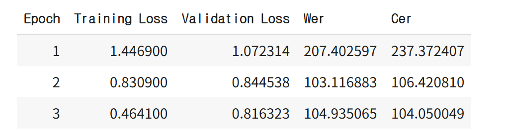
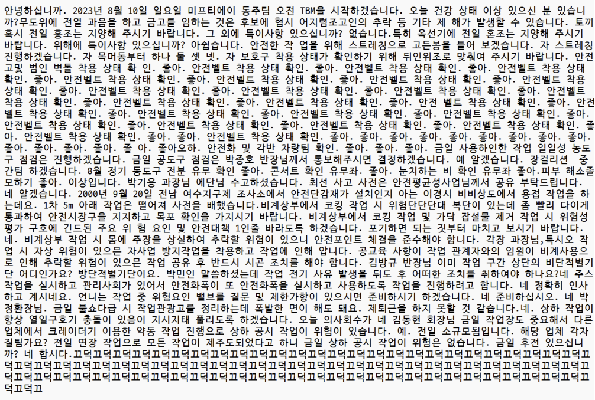
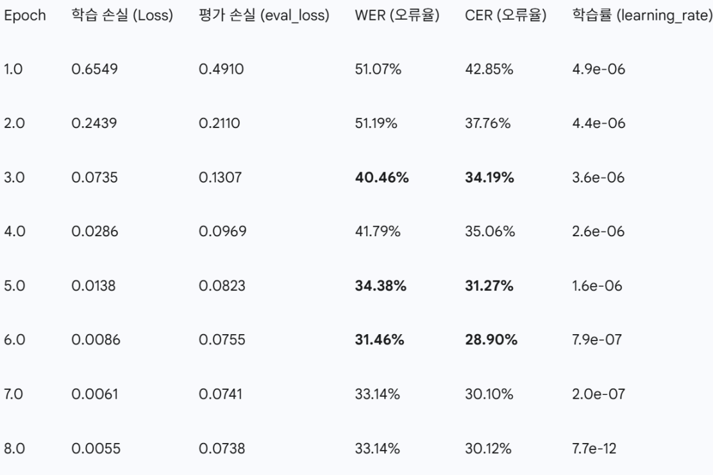
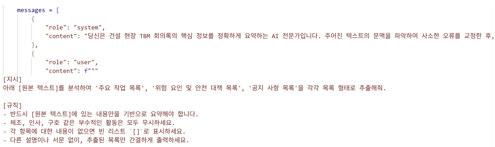

# 🚀 TBM 회의록 자동 분석 모듈: 개발 일지

본 문서는 `위솔루션 안전관리시스템 고도화 프로젝트`의 상세한 개발 과정을 기록합니다.

---

## 🗓️ 1주차 (7/2 ~ 7/4): STT 모델 개발 및 LLM 연동 기반 기술 검증

1주차에는 프로젝트의 기술적 타당성을 검증하고 핵심 AI 모델을 구축하는 데 집중했습니다.

### Part 1. TBM 특화 음성인식(STT) 모델 개발

- **초기 난관: 과적합(Overfitting) 문제 직면**
  - `Whisper-small` 모델을 소량의 TBM 데이터로 직접 파인튜닝 시, 모델이 훈련 데이터만 암기하여 처음 듣는 음성에는 의미 없는 단어를 반복하는 '고장 현상' 발생.
  - 
  - 

- **해결 계획: 3단계 점진적 파인튜닝 전략 수립 및 실행**
  - **1단계 (일반화):** AI-Hub의 '일반 회의 데이터'(15시간)로 사전 훈련하여, 모델의 일반적인 대화 이해 능력 확보 (CER 50.4% 달성).
  - **2단계 (전문화):** 1단계 모델을 '실제 TBM 데이터'(1시간)로 훈련시켜, TBM 전문 용어 학습.
  - **3단계 (강인화):** 데이터 증강(Data Augmentation) 기법을 적용한 데이터로 훈련시켜, 현장 소음 및 다양한 발화 환경에 대한 대응 능력 강화.

- **해결 성과: WER, CER 점수 대폭 하향**
  - 검증 데이터셋 기준 **CER(글자 오류율) 28.9%** 달성.
  - 

### Part 2. LLM 기반 정보 추출 테스트

- **초기 난관: 'Garbage In, Garbage Out' 문제**
  - STT 결과물에 남은 작은 오류들로 인해, 소형 언어 모델(LLM)이 문맥을 이해하지 못하고 관련 없는 내용을 지어내는 **환각(Hallucination)** 현상 발생.
- **해결 계획: 고도화된 프롬프트 엔지니어링 적용**
  - 모델의 역할을 명확히 정의하고, '작업-위험-대책'의 관계를 학습시키며, 구체적인 출력 형식을 제공하는 등 프롬프트를 점진적으로 개선.
  - 
---

## 🗓️ 2주차 (7/7 ~ 7/11): [계획]

- [ ] **STT 모델 성능 고도화**: 추가 TBM 데이터 확보 및 `whisper-small` 모델 파인튜닝을 통한 CER 20% 미만 달성 목표.