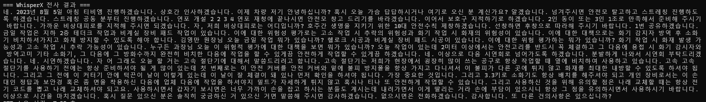
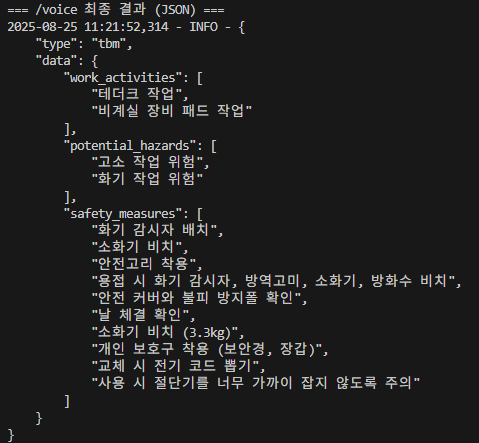
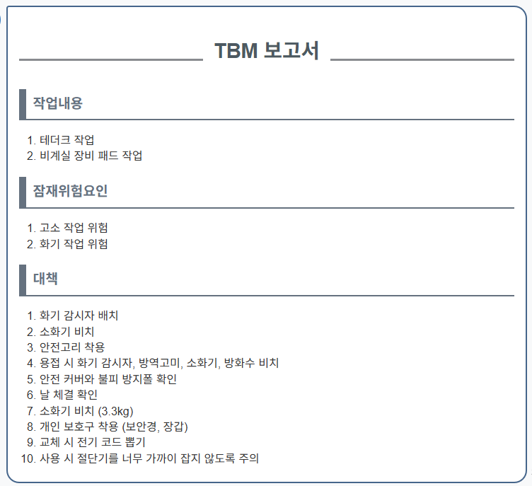

# AI TBM 요약 시스템

**본 프로젝트는 `위솔루션 2025년 여름방학 현장실습`의 일환으로 진행되었습니다.**

## 📌 프로젝트 개요 (Overview)

WESOLUTION-TBM-Summarizer는 **음성인식 기반 회의록 자동 요약 시스템** 입니다. 건설 현장에서 구두로 진행되는 TBM(Tool Box Meeting)의 음성 파일을 **음성 인식 모델(STT)** 로 텍스트화하고, **대규모 언어 모델(LLM)** 을 활용해 핵심 안전 정보를 자동으로 추출합니다.

## ✨ 핵심 기능 (Core Features)

### AI 음성인식 (AI Speech-to-Text)
- 현장 소음(장비 소음, 주변 대화 등)과 전문 용어에 강인한 TBM 특화 STT 모델을 개발 및 적용하여 높은 정확도의 전사(Transcription)를 제공합니다.
- 긴 오디오 파일을 효율적으로 처리하기 위해 whisperx 기반의 고속 전사 파이프라인을 구축하여 실시간에 가까운 분석을 지원합니다.

### 다단계 텍스트 처리 (Multi-stage Text Processing)
- **1단계: LLM 기반 텍스트 교정**: STT 모델의 전사 오류(예: 동음이의어, 문맥상 어색한 단어)를 LLM이 스스로 판단하여 정확한 작업 용어로 자동 수정합니다.
- **2단계: 핵심 정보 추출**: 교정된 텍스트에서 '작업 내용', '잠재 위험 요인', '안전 대책' 등 3대 핵심 정보를 사전 정의된 형식에 맞춰 구조화된 데이터로 추출합니다.

### 보고서 자동화 (Automated Reporting)
추출된 정보를 바탕으로 안전관리 보고서를 자동으로 생성하여, 데이터 입력 및 분석에 소요되는 시간을 획기적으로 단축합니다.

---

## 🌟 TBM 특화 파인튜닝 (PEFT)
현장의 특수한 음향 환경과 전문 용어에 최적화된 모델을 구축하기 위해, 다양한 현장 TBM 오디오 파일을 수집하여 훈련 데이터셋을 만들었습니다. 이 데이터셋을 활용해 Hugging Face의 'seastar105/whisper-small-komixv2' 모델을 PEFT(Parameter-Efficient Fine-Tuning)의 한 종류인 **LoRA(Low-Rank Adaptation)** 기법으로 추가 학습시켰습니다.

## ⚙️ 아키텍처 (Architecture)

본 시스템은 모듈화된 파이프라인을 통해 각 단계의 전문성을 극대화합니다.

1. **STT 변환 모듈 (whisperx)**: TBM 음성 파일을 입력받아 고성능 STT 모델로 초고속 텍스트 전사를 수행합니다.

2. **텍스트 전처리기 (LlamaCpp, 1단계)**: 전사된 텍스트의 미세한 오류를 [SKT A.X-4.0-Light-GGUF](https://huggingface.co/Mungert/A.X-4.0-Light-GGUF)와 같은 LLM으로 교정하여 정보의 정확성을 1차적으로 확보합니다.

3. **핵심 정보 추출 모듈 (LlamaCpp, 2단계)**: 교정된 텍스트를 LLM에 입력하여 안전 관리 전문가의 관점에서 필요한 정보만을 json 양식으로 추출합니다.

4. **위솔루션 안전관리시스템**: 추출된 구조화 데이터를 API 연동을 통해 웹사이트에서 활용합니다.

---
## 📚 기술 스택 (Tech Stack)

- **Language**: Python 3.10+
- **AI/ML Frameworks**: PyTorch, Hugging Face transformers
- **STT**: TBM 특화 Whisper 모델(whisperx로 고속 추론)
- **Model Fine-tuning**: PEFT (Parameter-Efficient Fine-Tuning)
  - **PEFT Library**: Hugging Face peft
  - **Base Model**: Hugging Face의 한국어 파인튜닝 모델 `seastar105/whisper-small-komixv2`
- **LLM Inferencing**: llama-cpp-python (GGUF 모델 로딩 및 추론)
- **Data Handling**: Pandas, librosa, re (정규표현식)
- **Server**: Flask, Flask-CORS

---
## 🗓️ 개발 일지 (Development Log)

프로젝트의 상세한 개발 과정, 문제 해결 기록, 주차별 목표는 아래 링크에서 확인하실 수 있습니다.

> **[🚀 개발 일지 전체 과정 상세 보기 &rarr;](DEV_LOG.md)**

---
## 💡 향후 개선 방향

- **실시간 처리 기능**: 스트리밍 오디오를 직접 입력받아 실시간으로 TBM 회의를 분석하는 기능 추가.
- **멀티모달 통합**: 현장에서 촬영된 이미지나 도면을 함께 분석하여 위험성 평가의 정확도를 높이는 기능 개발.
- **사용자 피드백 루프**: 현장 관리자가 추출된 결과에 직접 피드백을 제공하고, 이를 학습 데이터로 활용하여 모델의 성능을 지속적으로 개선.
