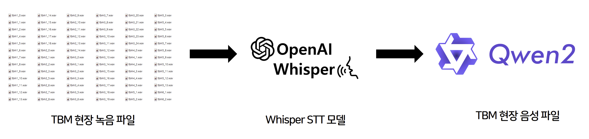

<<<<<<< HEAD
# WESOLUTION-TBM-Analyzer
AI 음성인식 기반 TBM 회의록 자동 분석 
=======
# 위솔루션 안전관리시스템 고도화를 위한 TBM 회의록 자동 분석 모듈

**본 프로젝트는 `위솔루션 2025년 여름방학 현장실습`의 일환으로 진행되었습니다.**

## 📌 프로젝트 개요 (Overview)

**위솔루션(WESOLUTION)**의 현장 안전관리시스템(WeSafe)에 통합될 AI 기반 자동화 모듈입니다. TBM(Tool Box Meeting) 음성 파일을 텍스트로 변환하고, 핵심 안전 정보를 자동으로 추출하여 보고서 생성을 자동화함으로써 데이터 기반의 선제적 안전 관리를 실현하는 것을 목표로 합니다.

## ✨ 주요 기능 (Key Features)

* **음성 자동 변환:** 건설 현장의 TBM 음성 파일을 텍스트로 자동 변환합니다. (STT, Speech-to-Text)
    * 현장 소음과 전문 용어에 강인한 TBM 특화 STT 모델을 개발할 것입니다.
* **핵심 정보 추출:** 변환된 텍스트에서 '작업 내용', '위험 요인', '안전 대책'을 자동으로 식별하고 추출합니다.
* **보고서 자동화:** 추출된 정보를 바탕으로 안전관리 보고서 생성을 자동화합니다.

## ⚙️ 아키텍처 (Architecture)

**[TBM 음성 파일]** → **[1. STT 변환 모듈]** → **[2. 텍스트 전처리기]** → **[3. 핵심 정보 추출 모듈]** → **[위솔루션 안전관리시스템]**

## 📚 기술 스택 (Tech Stack)

* **Language**: Python
* **AI/ML Libraries**: PyTorch, Transformers, Datasets, stable-ts, audiomentations
* **Data Handling**: Pandas, librosa, re (정규표현식)

## 🗓️ 개발 일지 (Development Log)

프로젝트의 상세한 개발 과정, 문제 해결 기록, 주차별 목표는 아래 링크에서 확인하실 수 있습니다.

> **[🚀 개발 일지 전체 과정 상세 보기 &rarr;](DEV_LOG.md)**
>>>>>>> 580b10a (Initial commit: Project setup and development log)
